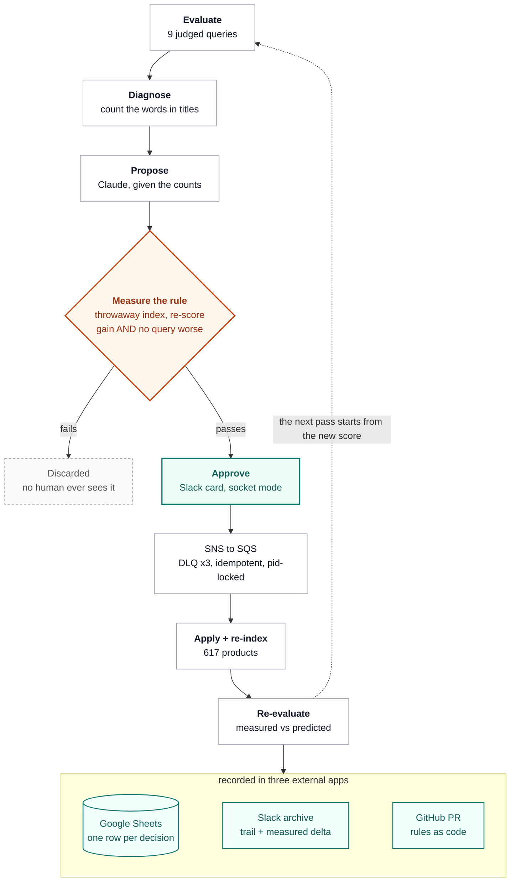

# Relevance Auditor

An agent that finds abandoned searches, proposes a fix with evidence, measures whether it will actually help before a human sees it, submits a solution on slack, fixes (if approved), first in the live index and creates a PR for permanently capturing the rule (reindexing), while maintaing an audit log in Google Sheets.


**[▶ Demo video (2 min)](Placeholder)**

## The problem

0.69% of all searches are made with an intention to buy - that's 100 million searches per day (sources at the bottom). Search relevance is the hardest problem to solve in search engines. The catalogue slice says **"sofa" in 81 product titles and "couch" in 10**. It says **"kids" in 23 and "toddler" in 2**. A shopper who types the word they actually use cannot reach the products - not because of ranking, but because the words are not in the index.

## The solution

The following results are from the WANDS dataset that has the human relevance judgements from Wayfair's own annotators, from which NDCG@10 is computed (the standard way to measure relevance on a 10 product resultset), which gives us the ***eval*** set.

```diff
- toddler couch fold out    NDCG@10  0.4045
+ toddler couch fold out    NDCG@10  0.6796            (+0.2751)
  every other query                                    unchanged
- mean across 9 queries              0.6949
+ mean across 9 queries              0.7254            (+0.0306)
```

Five of the ten results change. All five are kids sofas that were always in the
catalogue and were unreachable until the agent counted the words.

Three external apps: **Slack**, **Google Sheets**, **GitHub**. AWS is our own
infrastructure and Claude is the agent - neither is an integration, and saying so
before a judge asks is stronger than being caught at it.

---

## The gate

The model proposes different things on different runs. Across two consecutive live
runs, three candidates came back identical:

```diff
- chair   → armchair   -0.2851 worst   REJECTED
+ toddler → kids       +0.0306 mean    PROPOSED
- couch   → sofa       -0.0842 worst   REJECTED
```

The fourth was different every time:

```
run one   fold out → sleeper   +0.0024 mean   PROPOSED
run two   fold     → flip      +0.0127 mean   PROPOSED
```

Without a gate the demo swings on whatever the model happened to say. With one, the
swing is absorbed and the same rule survives.

> [!IMPORTANT]
> `couch → sofa` is a textbook synonym and it improves the average. It costs
> −0.0842 on "chaise lounge couch", so it is rejected and no human is ever asked
> about it. **A shopper does not experience the average.**

Two required conditions: the mean goes up, and no individual query goes down.
Validation runs on a throwaway index against a detached rule store, so nothing a
human has not approved is ever written.

## The loop



## Architecture

Three processes, one queue, three external apps.

| Process | Does | Fails how |
|---|---|---|
| `ui`      | two-panel search over two live indexes | stateless, restart freely |
| `socket`  | Slack Socket Mode; turns a click into a `Decision` on SNS | no inbound URL, nothing exposed |
| `worker`  | drains SQS, applies, re-indexes, re-scores, records | single instance, pid-locked |

**Why a queue at all.** Slack allows three seconds to acknowledge a click.
The work takes 6.64. Acknowledge, enqueue, answer later.

**Reliability**

- *Exactly-once effects* — `Idempotency` keys on decision id + verdict, so a
  redelivery cannot double-apply, and the key survives a worker restart.
- *One writer* — `PidLock`. Two workers silently split the queue, each handling
  half the approvals, which presents as "Slack is broken".
- *Poison messages* — DLQ after 3 receives, 180s visibility, 20s long poll.
- *Nothing unapproved is ever written* — validation builds a throwaway index
  against a detached rule store. The live store is untouched until a human clicks.
- *The claim is checked, not asserted* — after the real rebuild the measured
  delta is compared against what the gate predicted. Both were +0.0306.
- *88 tests*, no credentials required.

## One real run, on real infrastructure

One approval, measured from the click:

```
approved     +0.00s   APPROVE toddler → kids
queued       +0.48s   via SNS → SQS
applied      +0.94s   rule applied
reindexed    +1.24s   617 products
verified     +1.48s   +0.0306 measured, +0.0306 predicted
published    +5.59s   pull/10
recorded     +6.41s   row appended to the sheet
archived     +6.64s   trail posted
```

**6.64 seconds.** Slack allows three to acknowledge a click. That is the whole
reason there is a queue — and the pull request is four of those six seconds, so
the slowest hop is the one furthest from the person waiting.

The prediction held exactly: the gate said +0.0306 against a throwaway index, and
the real rebuild measured +0.0306.

Every one of those stages is written to `data/run-log.jsonl` as it happens. That
file is runtime state rather than a committed artefact, so a clone starts with an
empty trail and fills it on the first run.

## Notes

> [!NOTE]
> Every one of these is a question a judge would ask. Volunteering them costs
> nothing and it is what makes the measurement claims land.

- The slice is **curated** — 617 products and 9 queries drawn from WANDS, not the
  whole catalogue.
- The product images are **renders**, not photographs. Illustration only. Nothing
  in the pipeline reads them.
- There is **no embedder, no reranker, no hybrid retrieval**. BM25 and vocabulary
  rules are the only mechanism. The gains come from the rules.
- Diagnosis uses the **human relevance judgements**, exactly as validation does.
  The agent is auditing a judged set; that is what makes "did it help" answerable.

## Run it locally

> [!TIP]
> The offline path below needs **no credentials at all** and verifies the entire
> claim: the tests, the eval, and the two-panel UI with all 617 product renders.
> Credentials are only needed to drive the live Slack → SQS → Sheets → GitHub loop.

**Prerequisite: Java 21.**

### Without credentials

```bash
git clone https://github.com/rohit-gandhe/search-relevance-auditor
cd search-relevance-auditor

./gradlew test                                   # 88 tests
./gradlew run --args="eval"                      # 9 judged queries, mean 0.6949
./gradlew run --args='validate "couch|sofa"'     # the gate rejects it, and says why
./gradlew run --args='validate "toddler|kids"'   # this one passes
./gradlew run --args='compare "toddler couch fold out|toddler|kids"'
./gradlew run --args="ui"                        # http://localhost:7070
```

This runs on the 617-product slice, the relevance judgements and all 617 product images are
in the repo.

### With credentials — Slack → SQS → Sheets → GitHub loop

```bash
cp .env.example .env     # then fill in the six values below
```

| Variable | Where it comes from |
|---|---|
| `LLM_API_KEY` | console.anthropic.com |
| `SLACK_BOT_TOKEN` / `SLACK_APP_TOKEN` / `SLACK_SIGNING_SECRET` | a Slack app with Socket Mode on |
| `SLACK_APPROVALS_CHANNEL` / `SLACK_ARCHIVE_CHANNEL` | channel ids; invite the bot to both |
| `GOOGLE_SA_KEY` / `SHEET_ID` | a service account; share the sheet with its client_email |
| AWS | `./infra/deploy.sh` creates the topic, queue and DLQ, then `--write-env` |

```bash
./gradlew run --args="doctor"    # checks every credential and resource, read-only
./scripts/demo.sh start          # ui + socket + worker, detached
./gradlew run --args="propose"   # audit, then post what survives to Slack
./scripts/snapshot.sh baseline   # back to zero
```

> [!WARNING]
> Start the three processes with `demo.sh`, never by hand. A second worker
> silently takes half the approvals — with older code and a stale rule set — and
> it presents as "Slack is failing", intermittently. Check `status` reports
> `procs : 3` before you rely on it.

## Sources

- [New research on search abandonment in retail](https://cloud.google.com/blog/topics/retail/new-research-on-search-abandonment-in-retail) — Google Cloud
